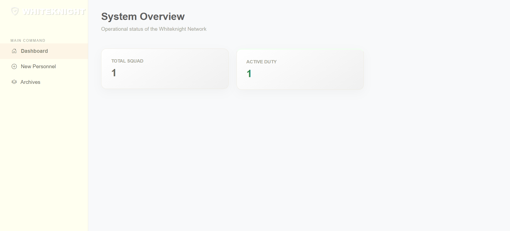
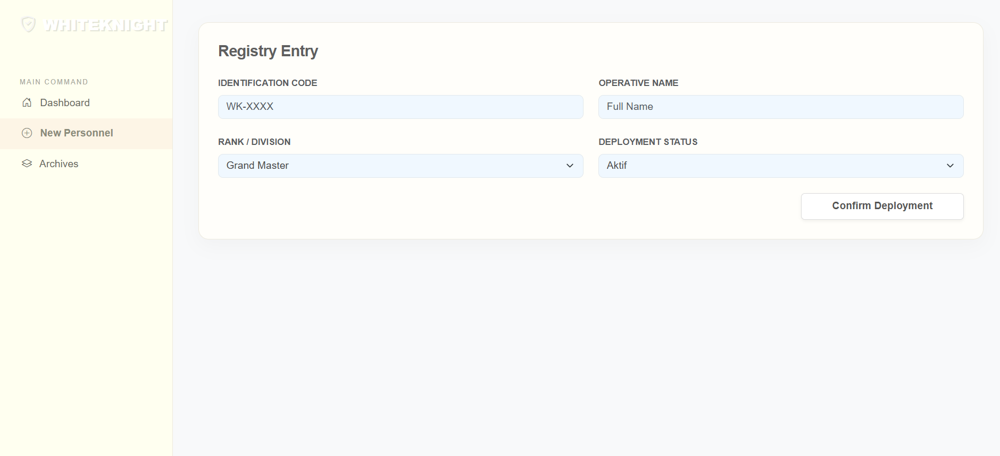
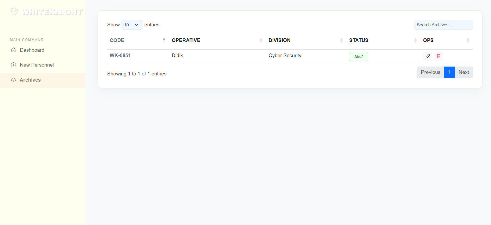

<div align="center">

# LAPORAN PRAKTIKUM
# APLIKASI BERBASIS PLATFORM
## COTS 2


### Disusun Oleh
**Alden Audy Akbar**  
**2311102309**  
**IF-11-04**

---

### Dosen Pengampu
**Cahyo Prihantoro, S.Kom., M.Eng.**

### LABORATORIUM HIGH PERFORMANCE
FAKULTAS INFORMATIKA  
UNIVERSITAS TELKOM PURWOKERTO  
2026

</div>

---

## 1. Dasar Teori

> ### Aplikasi Web & Node.js
> Aplikasi berbasis platform yang dikembangkan ini berjalan di atas **Node.js**, sebuah runtime JavaScript yang memungkinkan eksekusi kode di sisi server. Dengan menggunakan framework **Express.js**, proses pembuatan routing dan penanganan permintaan HTTP menjadi lebih efisien dan terstruktur.

> ### CRUD & JSON
> Sistem ini mengimplementasikan operasi **CRUD** (*Create, Read, Update, Delete*) untuk pengelolaan data mahasiswa. Data disimpan dalam format **JSON** (*JavaScript Object Notation*), yang merupakan format pertukaran data ringan dan mudah dibaca baik oleh manusia maupun mesin.

> ### DataTables & Validasi
> Untuk meningkatkan pengalaman pengguna (UX), aplikasi ini menggunakan **DataTables** untuk tabel interaktif dan **jQuery Validation** untuk memastikan data yang diinput pengguna sudah sesuai aturan.

---

## 2. Struktur Folder Proyek

> Berikut adalah susunan file dan folder dalam proyek **WHITEKNIGHT-SYSTEM**:

```bash
WHITEKNIGHT-SYSTEM/
├── assets/             # File gambar (Logo, Screenshot)
├── data/               # Penyimpanan database JSON (members.json)
├── node_modules/       # Library dependencies (npm)
├── public/             # File statis (CSS, JS, Images)
├── views/              # Template tampilan (index.ejs)
├── .gitignore          # Daftar file yang diabaikan Git
├── package.json        # Konfigurasi proyek & dependencies
├── server.js           # File utama backend (Express Server)
└── README.md           # Dokumentasi proyek
```

---

## 3. Kode Program

### A. Backend (`server.js`)

> File ini berfungsi sebagai server utama menggunakan **Express.js**. Di sini kita mengatur *routing* untuk API dan mengelola penyimpanan data ke file JSON.

```javascript
const express = require('express');
const fs = require('fs');
const path = require('path');
const { v4: uuidv4 } = require('uuid');

const app = express();
const PORT = 3000;

app.use(express.json());
app.use(express.urlencoded({ extended: true }));
app.set('view engine', 'ejs');
app.use(express.static('public'));

// Path Database
const DB_FILE = path.join(__dirname, 'data', 'members.json');

// Route Utama
app.get('/', (req, res) => {
    res.render('index');
});

// API Get All Members
app.get('/api/member', (req, res) => {
    const data = JSON.parse(fs.readFileSync(DB_FILE));
    res.json({ data });
});

// API Create Member
app.post('/api/member', (req, res) => {
    const data = JSON.parse(fs.readFileSync(DB_FILE));
    const newMember = { 
        id: uuidv4(), 
        ...req.body, 
        joined_at: new Date().toISOString().split('T')[0] 
    };
    data.push(newMember);
    fs.writeFileSync(DB_FILE, JSON.stringify(data, null, 2));
    res.json({ success: true });
});

app.listen(PORT, () => console.log(`Server berjalan di http://localhost:${PORT}`));
```

### B. Frontend (`views/index.ejs`)

> Bagian ini menangani tampilan antarmuka pengguna, menggunakan Bootstrap 5 untuk desain, DataTables untuk tabel interaktif, dan jQuery Validation untuk validasi form.

```javascript
$(document).ready(function() {
    // Inisialisasi DataTables
    $('#memberTable').DataTable({
        ajax: '/api/member',
        columns: [
            { data: 'nim' },
            { data: 'nama' },
            { data: 'email' },
            { data: 'joined_at' },
            { 
                data: 'id',
                render: function(data) {
                    return `<button class="btn btn-sm btn-danger">Hapus</button>`;
                }
            }
        ]
    });

    // Validasi Form
    $("#formMahasiswa").validate({
        rules: {
            nim: { required: true, minlength: 10 },
            nama: { required: true },
            email: { required: true, email: true }
        },
        submitHandler: function(form) {
            // Logika AJAX Post ke /api/member
        }
    });
});
```

---

## 4. Cara Menjalankan Aplikasi

> 1. Pastikan **Node.js** sudah terinstal di laptop.
> 2. Buka terminal di folder proyek (`WHITEKNIGHT-SYSTEM`).
> 3. Jalankan perintah: `npm install`
> 4. Jalankan server: `node server.js`
> 5. Buka browser dan akses: [http://localhost:3000](http://localhost:3000)

---

## 5. Hasil Pengujian (Screenshots)

### A. Halaman Utama & DataTables


### B. Form Tambah Data & Validasi


### C. Notifikasi & Penyimpanan Data



### Drive: https://drive.google.com/drive/folders/1hfP29NWbx5PyWpaoQ-F0dfrBgjGE9a9h?usp=sharing